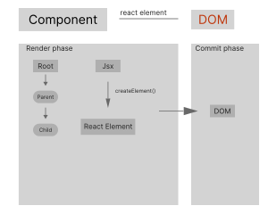

# React docs

There are two types of components in react

- Function Component
- Class Component

## Basics

### Props

props are `readonly` don't edit the value.

```jsx
const Greet = (props) => <h1> Hello {props.name} </h1>;

<Greet name="Ahmed" />;
```

use `props.children` to add child elements

```jsx
const Greet = (props) => <h1> Hello {props.children}</h1>;

<Greet>Ahmed </Greet>;
```

### Methods as props

```jsx
function Greet(props) {
  return (
    <div>
      <button onClick={props.greetHandler}>Say hi</button>
    </div>
  );
}

<Greet greetHandler={() => alert("Hi")} />;
```

### State on class component

if you want to edit the state use `setState()`

```jsx
class Greet extends React.component {
constructor() {
this.count = 0;
}

function updateCounter() {
// update passed on preveiw state.
this.setState(
(prevState, props) =>
({count : prevState.count + 1});
);
}
	}
```

**Notes**

- Always use `setState` and never modify the state directly.
- When you have to update state based on the previous state pass in a function instead of object.

### Event Handling

```jsx
function User() {
  const clickHandler = () => console.log("btn is clicked");

  return <button onClick={clickHandler} />;
}
```

### Conditional Rendering

```jsx
function User(props) {
  const isLogin = props.isLogin;

  // 1
  if (isLogin) {
    return <div>user is login in</div>;
  }

  // 2
  return isLogin ? <div> user is login </div> : <div>User isn't login</div>;

  // 3
  return isLogin && <div> User is login </div>;
}
```

### List Rendering

use `map()` to rednder list of item

```jsx
const Items = () => {
  const list = [1, 2, 3];

  return (
    <div>
      {list.map((item) => (
        <div> {item} </div>
      ))}
    </div>
  );
};
```

### Lifecycle Methods

1. **Mounting :** when an instance of a components is beging created and insearted into the `DOM`.

2. **Updating :** when a component is begins `re-rendered` as a result of changes to either its props or state.

3. **Unmounting :** When a Component is begins removed from the `DOM`.

4. **Error handling :** When there is an error during rendering, in a lifecycle method, or in the contractor of any child component.

### Fragment

you can use

- `<> </>`
- `<fragment> </fragment>` if you want to rendering a list with a key you can put the key on `<fragment key={}>`

```jsx
const User = () => {
  return (
    <>
      <div />
      <div />
    </>
  );
};
```

### Pure Component in a class.

Components will `be re-redndering` if one of its value change otherwise will not `good for performance`.

**When use it never mutate the state**. Always return new object the reflects the new state.

### Pure component in Function.

use `memo`

```jsx
const UserMemoFunc = () => {};

export default React.memo(UserMemeFunc);
```

### Refs

```jsx
const User = () => {
	const inputRef = React.createRef();

	return (
		<div>
			<input ref={inputRef} />

			<button onClick={ () => inputRef.focus()}>
				focus theinput.
			</button>
		<div>
	);
};


```

**Forwarding Ref**
Ref forwarding is a technique for automatically passing a ref through a component to one of its children.

```jsx
const Btn = React.forwardRef((props, ref) => (
  <button ref={ref}>{props.children}</button>
));

// You can now get a ref directly to the DOM button:
const ref = React.createRef();
<Btn ref={ref}>Click me!</Btn>;
```

### Portals

render component ouside root div.

```jsx
const PortalDemo = () => {
  return ReactDOM.createPortal(
    <div />,
    document.getElementById("portal-root-el")
  );
};
```

### Error Boundary in **class**.

a class component that implements one or both of the lifecycle methods

- `getDerivedStateFromError` used to render a fallback UI After an error is thrown.
- `componentDidCatch` used to log the error information

### Higher Oreder Components **HOC**.

>     Used to share common functionality between components.

A pattern where a function take a component as an argument and return new component

```jsx
const withCounter = (Component, countValue = 0) => {
	const count = useState(countValue);

	return const NewComponent = (props)=> {
		return <Component {...props} />;
	}
};

function hoverCounter () {}

export default withCounter(hoverCounter);

```

### Render Props

_share common functionality_

- The term `render prop` refers to a technique for sharing code between react components using a prop. whose value is a function.

```jsx
// my comp
const ClickCounter = ({ count, incrementCount }) => {
  return (
    <div>
      {count}

      <button onClick={incrementCount}> </button>
    </div>
  );
};

const Counter = (props) => {
  const [count, setCount] = useState(0);

  const incrementCount = () => setCount((prevState) => (prevState += 1));

  return <div>{props.render(count, incrementCount)}</div>;
};

<Counter
  render={(count, incrementCount) => (
    <ClickCounter count={count} incrementCount={incrementCount} />
  )}
/>;
```

### Context

Provides away to pass data through the component tree without having to pass props down manyually at every level.

```jsx

/* UserContext.jsx */
const UserContext = React.createContext('Default value');

const UserProvider = UserContext.Provider;
const UserConsumer = UserContext.Consumer;

export {UserProvider, UserConsumer};

/* Parent.jsx */
import {UserProvider} from "./UserContext";
import Child from './Child';

const Parent = () => {
	return <div>
		<UserProvider value="Ahmed">
			<Child />
		</UserProvider>
	</div>
}


/* Child.jsx */
import {UserConsumer} from 'UserContext';

function Child = () => {
	return <UserConsumer>
		{ username => <div> Hello {username} </div> }
	</UserConsumer>
}
```

you should use `hooks` instead of this way.

## Hooks.

### useState

```jsx
const [value, setValue] = useState(1);

setValue(30); // not safe if you wnat to update by old value.

setValue((prevState) => prevState + 3); // safe
```

When you use object or array. `useState` will not merge automaticly.
isnted return new instance.

```jsx
const [list, setList] = useState([]);

function addToList(value) {
  setList((prevState) => [...prevState, value]);
}
```

### useEffect

lets you perform side effects in function components.

- It is a close replacement for `componentDidMount` `componentDidUpdate` `componentWillUnmount`

```jsx
useEffect(() => {
  // used it to clean event from the dom or clearInterval()
  return () => {};
}, []);
// second param is a array its value for conditionaly run effect.
// if the values change useEffect will run again.
```

### Context hooks

```jsx
import UserContext from "./UserContext";

function User() {
  const username = useContext(UserContext);

  return <div> {username} </div>;
}
```

### useReducer

Is A hook used for advanced state mangament

```jsx
const initState = { first: 0 };

const reducer = (state, action) => {
  switch (action.type) {
    case "increment":
      return { first: state.first + 1 };
    case "decrement":
      return { first: state.first - 1 };

    default:
      return state;
  }
};

function Counter() {
  const [count, dispatch] = useReducer(reducer, initailState);

  return (
    <div>
      {count}

      <button onClick={() => dispatch({ type: "increment" })}>
        increment count
      </button>
    </div>
  );
}
```

if you use `useReducer` + `useContext` you can create global state management.
use this carefully.

### useState vs useReducer

| type                        | useState                | useReducer    |
| --------------------------- | ----------------------- | ------------- |
| Best for                    | Number, String, Boolean | Object, Array |
| number of state transitions | one or two              | too many      |
| Related state trasnition    | no                      | Yes           |

### useCallback

Is a hook that will return a memorized version of the callback function that only change if one of the dependencies has changed.

```jsx
function User() {
  const [age, setAge] = useState(20);

  // callback will cashe the function
  const incrementAge = useCallback(() => setAge(age + 1), [age]);

  return <div> {username} </div>;
}
```

### useMemo

cashe the function return.

```jsx
function User() {
  const [number, setNumber] = useState();

  const isEven = useMemo(() => {}, [number]);
}
```

### useRef

```jsx
function User() {
  const inputRef = useRef(null);

  return (
    <div>
      <input ref={inputRef} />
    </div>
  );
}

// useRef with interval
function U() {
  const intervlRef = useRef();

  useEffect(() => {
    intervlRef.current = setInteval();
  });

  // clear the interval
  function clear() {
    clearInterval(intervlRef.current);
  }
}
```

### Custom hooks

we used it to share logic

>     Alternative to HOCs and rednder props

**Notes**

- Javascript function name must starts with `use`
- A custom hook can call other hooks if required.

```jsx
/* useDocumentTitle */
function useDocumentTitle(count) {
  useEffect(() => {
    document.title = count;
  }, [count]);
}

export default useDocumentTitle;

/* Counter.jsx */
import useDocumentTitle from "./useDocumentTitle.jsx";

function Counter() {
  const [count, setCount] = useState(0);

  useDocumentTitle(count);
}
```

## React render notes



Rednder phsase

1. Find all elements flagged for update.
2. For each flogged components, covert jsx to react element and store the result.
3. perform reconciliation `Difference between` old and new tree.
4. Hand over the changes to the next phrase.

### useState and useReducer

- will not `re-render` if it the same value after the initial render.
- same value after `re-render` react will render that specific component one more time and then bails out from any subsequnt reders.

**State Immutability 'object, array'**
To `re-render` pass new referance.

**Avoide Un necessary render by**

1. pass the child as a children prop ex`<Paren> <Child /> </Parent>`
2. use `React.memo()`

### Same Element refernece

- state change? will `re-render`
- Props change? will not `re-render`

### React.memo

Parent Component `re-render` but the child need to be `un-render`
if there no changes

**Note**
Don't use `React.memo` if you have children

### Ways to cause a `re-render`

- Component call useState or userReducer
- If parent component `re-rendered`
- React context change
